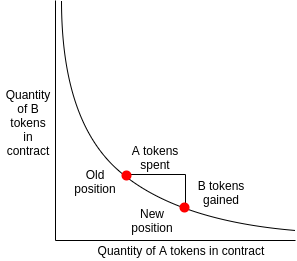

# Zeedex AMM v0.2

This repository is a Liquidity Module for the Zeedex Exchange.

Liquidity Modules allow to instantly fill orderbooks and bootstrap liquidity with minimal effort. This particular module uses Constant Product Market Making Model along with price maintenance with remote indexes, discussed in greater detail below.

#### Using this repository

This repository is designed to start a market making bot to provide liquidity on Zeedex.
This isn't made with profitability in mind, but simply filling and maintaining the orderbook, this bot is open source and you can build your own algorithms for better results.
**Under Development in Early Beta Channel (Use at your own risk)**

---

# AMM Bots

Automated Market Making (AMM) bots provide liquidity to a marketplace through use of algorithmic market making.

#### Running the AMM Bot

This repository is setup to run naturally on the Zeedex Exchange.

**Note - Make sure, the wallet you are using has approved both tokens on Zeedex already.**


Production -

```
npm install
npm start
```


Development -

```
npm install
npm run dev
```


#### Environment Variables

```
PRIVATE_KEY=053kjklajskldnn......             // Private Key of the main wallet
BASE_SYMBOL=ZDEX                              // Base token symbol
QUOTE_SYMBOL=USDT                             // Quote token symbol
DEX_API_URL=https://bsc-api.zeedex.io         // Api url
SPREAD=0.01                                   // Spread between Buy and Sell side
PRICE_GAP=0.02                                // Price Gap between orders. Next order = order * (1 +step)
EXPAND_INVENTORY=0.05                         // % increase your order sizes linearly.
MAX_ORDERBOOK_LENGTH=10                       // Orderbook Length each side
RPC_URL=                                      // RPC Node URL, eg - infura, etc
SPEED=10000                                   // Speed (ms) to reload the bot (update price, cancel, create orders)
MANUAL_INIT_PRICE=                            // Initial Price in Quote (USDT in ZDEX-USDT pair) | Example - 0.927
DEBUG=true                                    // See Logs
```


---

## Algorithm Variables

#### Constant Product AMM

This bot runs a "constant product market maker model" (popularized in the DeFi community by Uniswap). In short, this model generates a full orderbook based on an initial price for the market. Every transaction that occurs on this market will adjust the prices of the market accordingly. It's a basic supply and demand automated market making system.

- Buying large amounts of the base token will increase the price
- Selling large amounts of the base token will decrease the price

A typical Constant Market Making model has a continuous price curve. This bot discretizes the continuous price curve and creates a number of limit orders to simulate the curve. The order price is limited between `BOT_MAX_PRICE` and `BOT_MIN_PRICE`. The price difference between adjacent orders is `PRICE_GAP`. 


([Image Source](https://medium.com/scalar-capital/uniswap-a-unique-exchange-f4ef44f807bf))

Constant product algorithms have a disadvantage of low inventory utilization. For example, by default it only uses 5% of your inventory when the price increases 10%. `EXPAND_INVENTORY` can help you add depth near the current price.

- `PRICE_GAP` Price difference rate between adjacent orders. For example, ask price increases by 2% and bid price decreases by 2% if `PRICE_GAP=0.02`.
- `EXPAND_INVENTORY` Order sizes difference amount between adjacent orders spread linearly. For example, all order sizes will be increased linearly by 5% if `EXPAND_INVENTORY=0.05`.

#### Liquidity Sourcing In Constant Product AMM

Constant Product AMM requires a single source of funds for both the base and quote token. As such, the general flow of setting up the AMM bot from scratch is:

- Prepare an address that holds both the BASE and QUOTE token of the trading pair you want to provide liquidity for
- Set the initial parameters for the bot
  - This determines the initial price, spread, sensitivity, etc.
- Run the bot

Upon running the bot, it will get remote price from the source you mentioned (coingecko,etc), generate an orderbook for your marketplace. The orderbook will appear to be static, but every trade will shift the market accordingly.

After every order maintenance it will also check for arbitrage values, if the remote price is up, the bot will shift bottom orders to the top and maintain this 2-wheel-roll pattern in opposite direction when shifting down.

#### Further Information On Constant Product AMM

For more information on these models, Scalar Capital provided a [detailed analysis of constant market making](https://medium.com/scalar-capital/uniswap-a-unique-exchange-f4ef44f807bf).


---

## License

This project is licensed under the Apache 2.0 License - see the [LICENSE](LICENSE) file for details